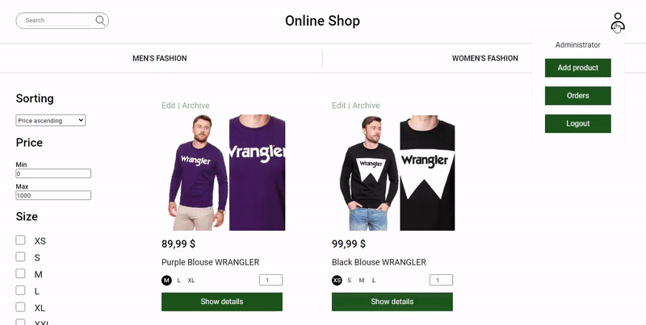
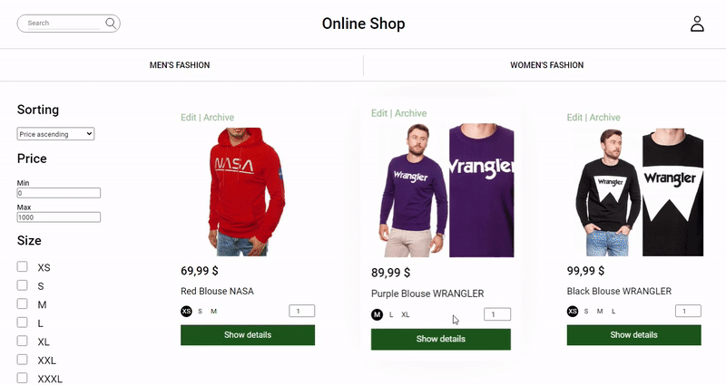
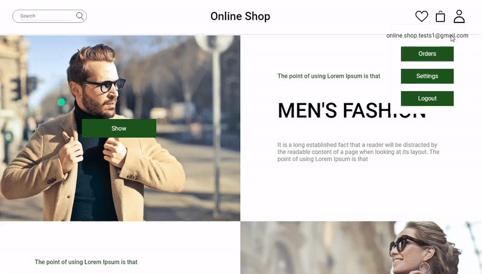
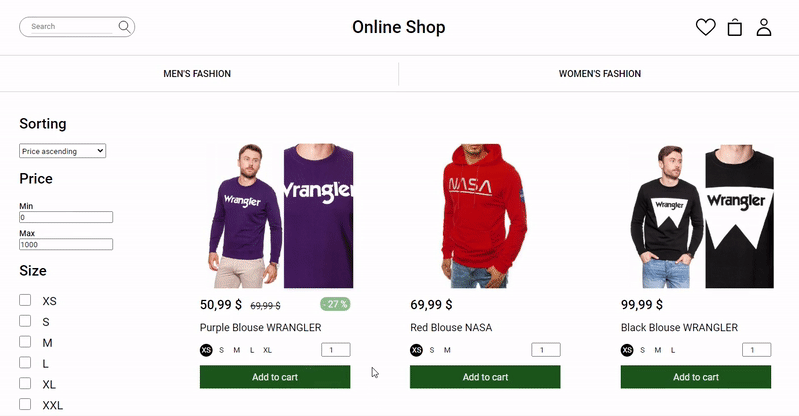

# Online Clothing Shop

**An application that performs the basic functions of an online shop:**

  - Login and register new users.
  - Editing user account (change/reset password,  change user name and address)
  - CRUD of products (inluding images uploading).
  - Searching products, filtering and sorting results.
  - Session-based shopping cart.
  - Saving favourites products.
  - Orders.
  - User’s purchase history.
  - Admin panel.
  - List of all transactions in admin panel and ability to change their status.
  - Sending email-confirmation, order-summary and password-reset emails.
  - Confirmation popups.
  - Product archive.

## Technologies

- ASP.NET Core 3.1 MVC
- Entity Framework
- Identity
- SendGrid
- SweetAlert 2
- AJAX

## Configuration
...
...

## Demonstration of functionality

### Administrator panel:

#### 1. Adding new product.

#### 2. Editing existing product.

As you can see on the gif below edit form allows to change data like name, description etc. Administrator can also add or remove products of the given size and lower the price. As a result new sizes, the old price, the new price and the discount can be seen additionally.

 

#### 1. Archiving and restoring products.

### Other users:

#### 1. New user registration.

 

#### 2. Email confirmation.

#### 3. Login to the created account.

#### 3. Reset password when forgot.

#### 5. Editing user data.

#### 6. Adding and removing favourite product.

 

### Common features: 

#### 1. Searching, filtering, sorting.

### Buying process:

#### 1. Adding and removing products from cart.

 

### 2. Finalization of purchases.

 

After making a purchase, the user receives an email with a summary

### 3. Change of order status by admin when it is ready to send.

